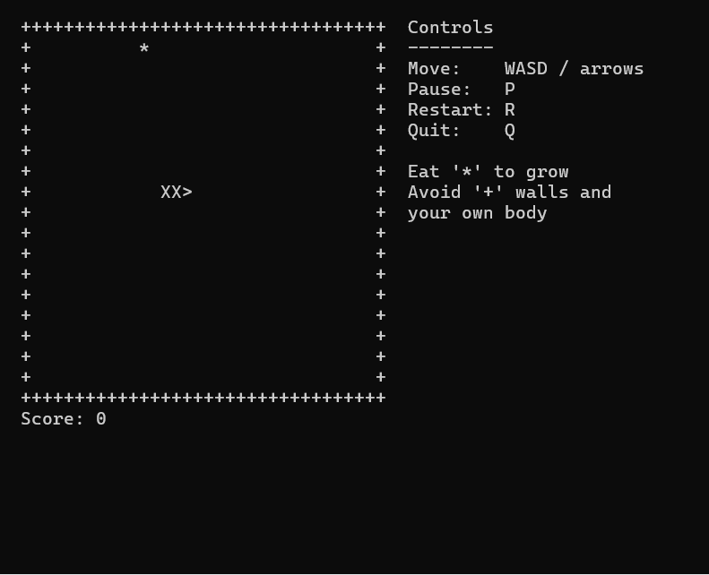

# Snake

A simple console Snake game (Windows only, uses `<windows.h>` and `<conio.h>`).

## Demo

## Developed with

Visual Studio 2022 (C++ Empty Project).

## How to open

1. Clone the repo.
2. Double-click `Snake.slnx` to open the solution in Visual Studio.
3. Press `Ctrl+F5` to build and run.

## How to play

Eat `*` to grow. Avoid the `+` walls and your own body.

## Controls

- `W` `A` `S` `D` or arrow keys - move
- `P` - pause / resume
- `R` - restart
- `Q` - quit
